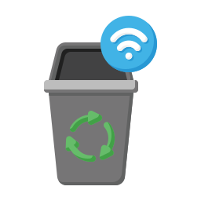
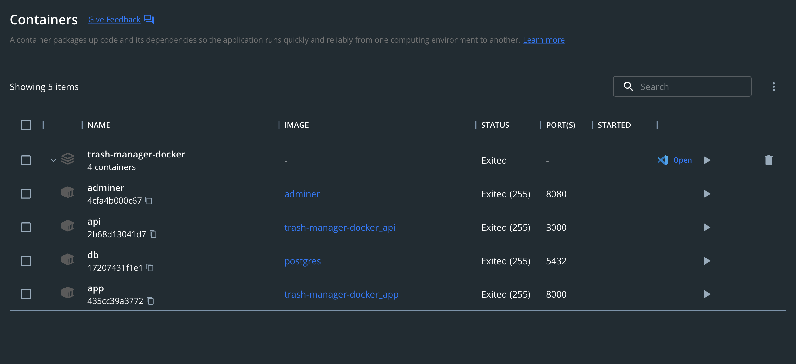

<h1 align="center">
  <br>
  
  <br>
  TrashManager
  <br>
</h1>

<h4 align="center">A web application that helps to manage condominium trash removal</h4>

<p align="center">
  <a href="#setup">Setup</a> •
  <a href="#how-to-use">How To Use</a> •
  <a href="#credits">Credits</a> •
  <a href="./LICENSE">License</a>
</p>



## Setup

To clone and run this application, you'll need [Git](https://git-scm.com), [Node.js](https://nodejs.org/en/download/) (which comes with [npm](http://npmjs.com)) and [Docker](https://www.docker.com/products/docker-desktop/) installed on your computer. From your command line:

```bash
# Clone this repository with submodules
$ git clone --recurse-submodules https://github.com/Alex100dre/trash-manager-main.git

# Go into the repository
$ cd trash-manager-main

# Run docker-compose
$ docker-compose up
```

> **Note** \
> On the first run, docker compose will create containers, pull images, pull node modules, create the database and then compile and serve the application, api and database.

## How To Use

Application is served through [http://localhost:8000/](http://localhost:8000/) and API through [http://localhost:8000/](http://localhost:8000/)

Check the following useful list of commands

```bash
# Start the project (use -d param to start the containers silently)
$ docker-compose up

# Stop containers (or press ctrl+c from the containers execution)
$ docker-compose stop
```

## Credits

Alexandre Hachim

## You may also like...

- [CSV Anonymizer](https://github.com/Alex100dre/csv-anonymizer) - A react application to anonymize CSV files
- [Notified Task](https://github.com/Alex100dre/notified-tasks) - A shell script to get notification when a task is done (for macOS)

---

> [le-dev.com](https://le-dev.com) &nbsp;&middot;&nbsp;
> GitHub [@Alex100dre](https://github.com/Alex100dre) &nbsp;&middot;&nbsp;
> LinkedIn [@alex100dre](https://www.linkedin.com/in/alex100dre/)

